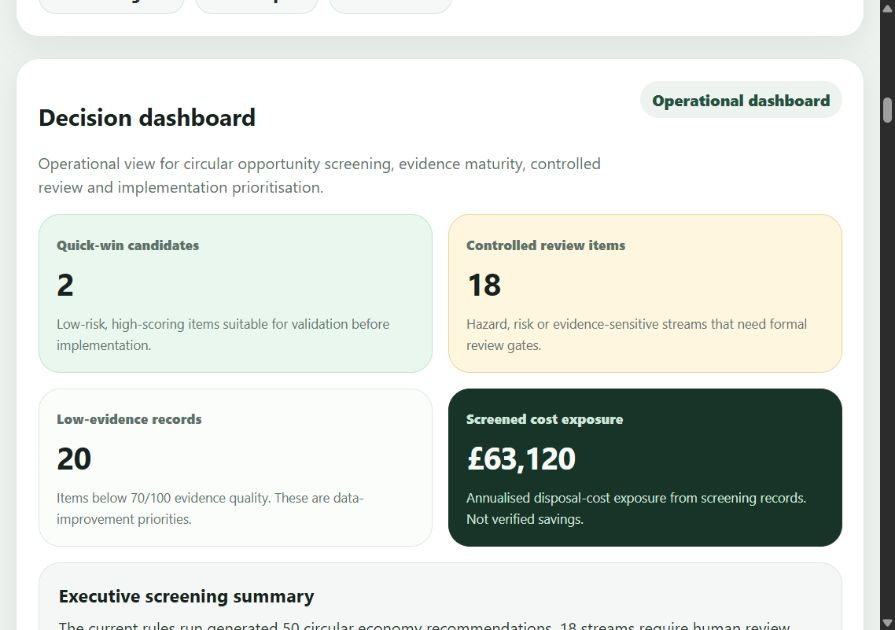
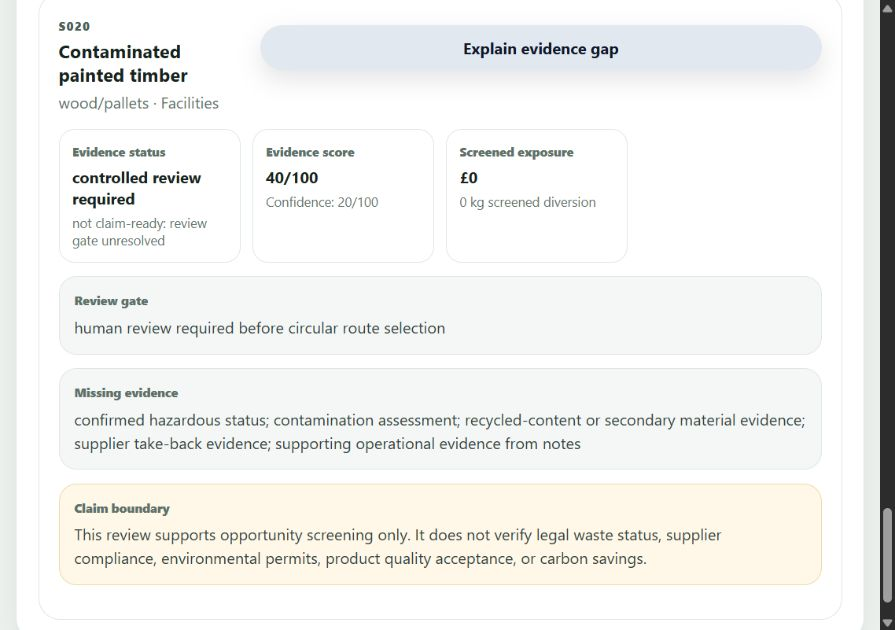
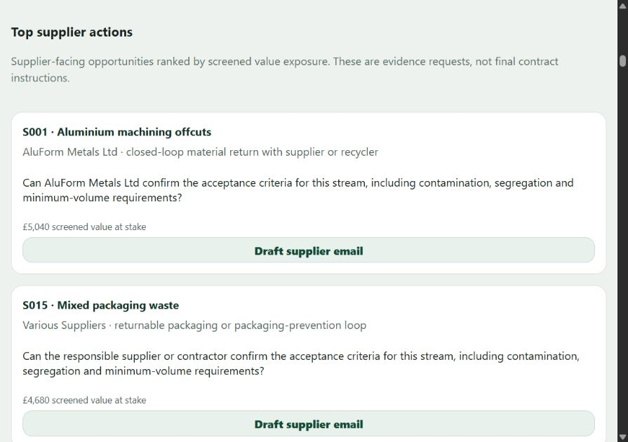

# Circular Industry AI

**Independent AI-supported circular economy and sustainability decision-support project**

Circular Industry AI explores how industrial operational data and publicly available sustainability information can be structured into evidence-aware, human-reviewed decision support.

The project combines my practical interest in **circular economy, resource efficiency and sustainable procurement** with independent research into wider corporate sustainability topics such as **ESG reporting, net zero, sustainability claims, greenwashing risk and environmental assessment**.

> **Scope note:** This is an independent development and learning project. I have not used the project to provide professional ESG assurance, certification or third-party verification. The system is designed to support analysis and investigation, not to replace qualified professional judgement.

---

## Project screenshots

Captured from the running project using its **50 synthetic industrial streams**. These demonstration outputs support screening and human review; they are not verified savings, environmental outcomes or professional assurance.



*Circular opportunity screening, with evidence gaps and review requirements visible alongside estimated cost exposure.*



*An evidence-sensitive record shows what is missing, why human review is required and which claims the output cannot support.*



*Circular opportunities become practical supplier questions and evidence requests for procurement review.*

---

## Why I built it

Industrial sustainability decisions often depend on fragmented information: material-flow data, supplier information, costs, environmental risks, evidence quality and corporate sustainability claims may all sit in different places.

I built Circular Industry AI to explore a practical question:

**Can AI help organise this information into a more structured, transparent and useful workflow while keeping evidence quality, human review and claim boundaries visible?**

The project therefore focuses less on creating a generic sustainability chatbot and more on building a controlled workflow around:

- circular economy and resource-efficiency opportunities
- material and waste-flow screening
- supplier and procurement actions
- evidence quality and missing-data visibility
- sustainability claim boundaries
- human review and approval gates
- decision-support outputs for operational users

---

## What the project demonstrates

Circular Industry AI currently demonstrates how raw industrial data can move through a controlled workflow:

```text
Raw operational CSV or sample data
→ data profiling and semantic role suggestions
→ operator-confirmed field mapping
→ controlled draft transformation and preview
→ approval-gated SQLite import and audit event
→ operator-triggered rules-based circular economy screening
→ risk, confidence and evidence scoring
→ evidence register and claim controls
→ circular resolution plans
→ supplier-loop and circular procurement intelligence
→ optional rules-locked AI explanation and drafting
→ visual analytics and operator drilldown
```

The aim is to make the reasoning, evidence gaps and review requirements visible rather than allowing AI to produce unsupported sustainability conclusions.

---

## Sustainability topics researched

The project has required independent research across several sustainability areas.

### Applied project focus

These areas are closest to my existing sustainability experience and form the core of the product logic:

- circular economy
- resource efficiency
- waste prevention, reuse and recovery
- sustainable procurement and supplier engagement
- material-flow analysis
- evidence quality and operational decision support

### Wider research exposure

To develop the AI-supported features and governance boundaries, I have also researched publicly available information relating to:

- ESG and sustainability reporting
- net-zero concepts and emissions reporting
- sustainability claims and greenwashing risk
- environmental performance indicators
- environmental assessment / EIA concepts
- evidence quality, traceability and claim readiness

These are **research and learning areas within the project**, not claims of professional delivery experience in ESG assurance, net-zero consulting, green-claims verification or EIA practice.

---

## How public information is used

The project has been developed using publicly available sustainability information, including material from sources such as:

- government and regulatory guidance
- recognised sustainability frameworks and standards
- corporate sustainability and ESG disclosures
- academic and industry publications
- circular economy, waste and resource-efficiency guidance

This information has informed the system's rules, prompts, knowledge structure, test scenarios and governance controls.

The project does **not** treat publicly available information as independently verified truth. Source quality, evidence gaps and the need for human review remain part of the workflow.

---

## Evidence and claim-safety approach

One of the main design principles is that sustainability outputs should not be stronger than the evidence supporting them.

The evidence workflow distinguishes between:

- measured data
- estimates
- assumptions
- missing evidence
- review requirements
- claim boundaries

This allows the system to identify where an apparent sustainability opportunity may still require more information before a credible conclusion or external claim can be made.

### Governance boundary

The rules engine remains the locked decision source.

AI/LLM features may explain, summarise, draft and support investigation, but they must not override:

- risk level
- human-review status
- rule applied
- claim boundary
- evidence controls
- legal/compliance status
- verified impact

Dashboard values are screening outputs. They are **not** verified savings, verified diversion, verified environmental benefit, supplier compliance confirmation, formal ESG assurance or externally validated sustainability claims.

---

## Example use case

A company may have operational data showing material use, waste routes, disposal costs and supplier information, while separately making sustainability commitments around waste reduction or circularity.

Circular Industry AI can structure the operational information, screen for circular opportunities, identify missing evidence, suggest supplier or procurement questions and show where further review would be needed before stronger sustainability conclusions are drawn.

For example:

```text
Material stream identified
→ current route reviewed
→ circular alternative screened
→ evidence quality checked
→ missing information highlighted
→ supplier / procurement action suggested
→ human review required where risk or uncertainty is high
```

This is decision support, not third-party verification.

---

## Current product capability

### 1. Controlled data intake and mapping

Users can profile uploaded CSV data before it enters the core workflow. The controlled intake process includes:

- structural and type profiling
- semantic role suggestions
- operator-confirmed field mapping
- required-role, duplicate-role and confidence validation
- mapped-row transformation into draft records
- row-level warnings and blocking errors
- preview and selected-row inspection
- explicit operator approval before persistence
- SQLite import with duplicate-ID protection
- import audit traceability
- a separate operator confirmation gate before recommendations run

Mapping validation confirms workflow readiness. It does not verify the truth, completeness or regulatory status of the source data.

### 2. Material-flow screening

After approved import, or after loading the sample dataset, users can manually run the locked rules engine to generate circular economy recommendations.

Each stream can receive:

- recommended circular action
- circular strategy category
- reasoning
- risk level
- confidence score
- evidence quality score
- missing data
- human-review flag
- estimated annual waste diversion
- estimated annual disposal cost exposure
- supplier/procurement action
- industrial symbiosis opportunity flag
- next action
- dashboard priority
- rule applied

### 3. Circular resolution planning

The Circular Resolution Engine translates recommendations into practical intervention plans, including:

- value-retention logic
- implementation steps
- process redesign actions
- supplier/procurement actions
- industrial symbiosis screening
- pilot plans
- KPIs
- evidence requirements
- decision gates
- fallback routes

### 4. Supplier-loop and circular procurement intelligence

The supplier-loop workflow turns circular recommendations into procurement-facing actions, including:

- reverse-logistics models
- supplier questions
- contract levers
- evidence requests
- commercial checks
- operational checks
- acceptance criteria
- pilot scopes
- fallback positions

### 5. Agentic research and insight workflows

The AI-supported layer includes:

- knowledge graph relationships
- controlled retrieval workflows
- insight generation
- insight history and traceability
- retrieval and insight quality evaluation

These features support investigation and drafting. They do not replace the locked rules engine or professional judgement.

### 6. Visual analytics and operator drilldown

The dashboard includes decision-useful visuals for:

- risk vs opportunity
- material quantity Pareto analysis
- cost exposure Pareto analysis
- evidence maturity
- claim-readiness control
- supplier-loop opportunity profile
- scenario screening

The operator can move from a visual signal into the underlying records:

```text
Visual signal → selected slice → compact records → selected inspector → review pack
```

---

## Data model

The sample dataset contains **50 synthetic industrial streams** across areas including:

- metals
- plastics
- cardboard and packaging
- wood and pallets
- chemicals and solvents
- textiles
- glass
- rubber
- electronic components
- organic and process residues
- process water and energy/resource streams

The synthetic dataset contains different conditions for testing, including low-risk recycling opportunities, supplier take-back routes, internal reuse, industrial symbiosis candidates, hazardous streams and weak-evidence cases requiring review.

Core fields include:

- `stream_id`
- `stream_name`
- `material`
- `source_process`
- `monthly_quantity_kg`
- `current_route`
- `disposal_cost_per_month`
- `contamination_risk`
- `hazardous_flag`
- `department`
- `supplier`
- `supplier_takeback_available`
- `recycled_content_available`
- `notes`

---

## Technology stack

- **Frontend:** React + Vite
- **Backend:** FastAPI
- **Database:** SQLite
- **Data handling:** CSV profiling, operator-confirmed mapping, controlled draft transformation, approval-gated import and structured API endpoints
- **AI layer:** optional rules-locked LLM explanation, drafting and research support
- **Testing:** backend pytest and frontend production build

---

## Development status

The repository currently implements the controlled local workflow through **Milestone 19D**.

The project remains development-stage software. Its outputs are screening and workflow records rather than externally verified environmental performance, legal conclusions or professional assurance opinions.

<details>
<summary><strong>Technical milestone history</strong></summary>

- **Milestones 1–8F: Core screening and controlled outputs** — dataset and repository foundation; FastAPI, SQLite and stream APIs; locked circular recommendation engine; React review interface; dashboard and filters; evidence register; Circular Resolution Engine; material playbooks; supplier-loop intelligence; AI-assisted evidence explanations, supplier drafting and circular action reports.
- **Milestones 9A–9F: Alpha hardening and traceability** — workflow readiness diagnostics; bounded AI runtime handling; frontend workflow guardrails; organisation, site and analysis-run metadata; audit events; CSV data-quality validation.
- **Milestones 10A–10E: Knowledge and autonomous insight layer** — knowledge architecture; controlled knowledge base; retrieval engine; autonomous insight generation; saved insight history and traceability.
- **Milestones 11A–11E: Agentic intelligence workflow** — knowledge graph relationships; agentic retrieval orchestration; retrieval and insight evaluation; operator UI; usability refinement.
- **Milestones 12A–12F: Professional intelligence interface** — visual analytics; drilldown and triage; product wording alignment; executive report generator; ESG/EIA issue register; scenario comparison.
- **Milestones 13A–13C: Workspace and claim-safety architecture** — domain workspace architecture; workspace contract hardening; metric and claim-safety wording.
- **Milestones 14A–14F: Data Profiler and ingestion design foundation** — profiler engine; foundation audit; profiler reliability plan; user-confirmed mapping specification; flexible import specification; mapping audit and saved-plan specification.
- **Milestones 15A–15B: Stability and V1 definition** — CI/dependency plan; V1 definition, readiness gates and scope boundaries.
- **Milestones 16A–16D: Data Profiler stabilisation** — edge-case tests; configuration modularisation; type-inference modularisation; semantic role-scoring modularisation.
- **Milestones 17A–17F: User-confirmed mapping** — validation contract and API; frontend API client; operator mapping panel; mapping UX hardening; role-option and copy alignment.
- **Milestones 18A–18E: Controlled draft import preview** — flexible import contract and endpoint; frontend client; draft preview panel; row inspection, grouped warnings and review-control hardening.
- **Milestones 19A–19D: Approved persistence and recommendation gate** — approval-controlled SQLite import; audit traceability; frontend save action; separate operator-triggered post-import recommendation run.

**Current implemented milestone: 19D — Post-import Recommendation Run Gate.**

</details>

---

## Local development

Start the backend:

```powershell
cd backend
.\.venv\Scripts\Activate.ps1
python -m uvicorn app.main:app --reload
```

Start the frontend in a second terminal:

```powershell
cd frontend
npm install
npm run dev
```

Open:

```text
http://127.0.0.1:5173
```

Run frontend build:

```powershell
cd frontend
npm run build
```

Run backend tests:

```powershell
cd backend
.\.venv\Scripts\python.exe -m pytest
```

---

## What I have learned from building it

The project has strengthened my ability to connect sustainability research with data structures, operational decision-making and evidence controls.

It has also given me a practical way to independently explore areas beyond my direct professional experience, including ESG reporting, net-zero concepts, greenwashing risk and sustainability claim credibility, while keeping a clear distinction between **research exposure** and **professional assurance or consulting experience**.

---

## Project limitations

Circular Industry AI is an independent learning and development project.

It does not provide:

- formal ESG or sustainability assurance
- certification
- legal or regulatory advice
- verified greenhouse-gas inventories
- professional EIA conclusions
- independent verification of corporate sustainability claims

Any real-world use would require appropriate primary evidence, subject-matter review, applicable standards and professional judgement.
